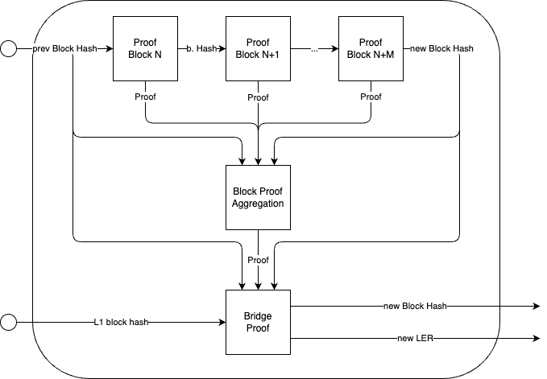

# FEP type I

The goal behind this PoC is to integrate an EVM type I prover to the uLxLy, using the full execution proof (FEP) path. The challenge is to be able to proof the bridge (consumed GERs + produced LERs), while using 100% vanilla client (gETH, rETH, ...)

## Block proof

Executes a block header using rETH (rsp)

- Input:
    - block header
- Commitment:
    - prev block hash
    - new block hash

## Block aggregation proof

Asserts that the blocks being aggregated are valid, and that they are in the correct order (prev block hash == new block header => parent hash)

- Input:
    - block proofs
    - block commitments
- Commitment:
    - prev block hash
    - new block hash

## Bridge proof

Checks that the injected GERs exist and commits to the new LER. This is done by:

1. Getting the last injected GER index from the previous block header (init GER index) using an `eth_call` to the L2 contract
2. Getting the last injected GER index from the new block header (last GER index) using an `eth_call` to the L2 contract
3. Getting all the GERs between init/last GER index using an `eth_call` to the new blcok header of the L2 contract
4. Assert that all the GERs exist on L1 by doing an `eth_call` to a valid L1 blcok to the GER getter contract
5. Get the new LER by doing an `eth_call` to the L2 contract to new blcok header and commit to it

TODO: merge bridge proof & block aggregation proof into a single proof