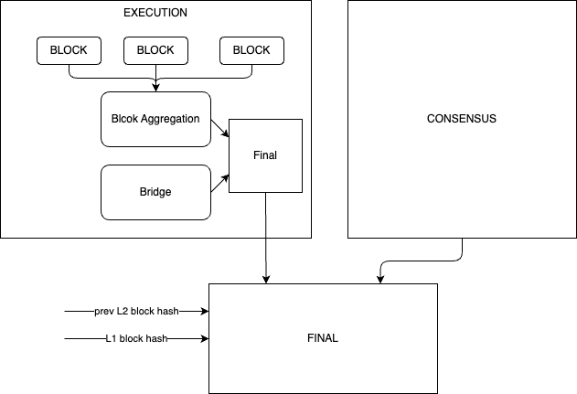

# OP

The goal of this PoC is to integrate an existing OP chain to the uLxLy, using:

## Proofs

### Execution proof

- Executes OP blocks
- Aggregates them
- Asserts the validity of injected GERs
- Commits to prev block hash + new block hash + new LER

### Consensus

- Asserts that the state root published on L1 is part of the new block hash that is beeing committed on the execution proof

## Relevant information

- [0x473300df21d047806a082244b417f96b32f13a33](https://explorer.optimism.io/address/0x473300df21d047806a082244b417f96b32f13a33) is the currrent proposer for OP mainent
- [0xe5965Ab5962eDc7477C8520243A95517CD252fA9](https://etherscan.io/address/0xe5965Ab5962eDc7477C8520243A95517CD252fA9) is the address where games are created
    - this happens once per hour
    - an event is emitted when a game is created: `DisputeGameCreated`, this event contains the address of the game
- A created game includes the l2 block number and the state root

All of this is subject to change. As the OP protocol is still evolving, and in particular fraud proofs have been recently introduced and later on halted...

## Doubts:

- It's unclear to me if the game factory is shared across different chains, and therefore we should check chain ID on each game.