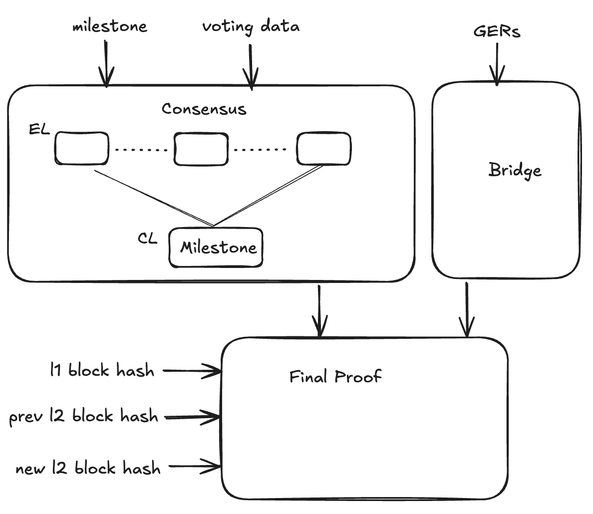

# PoS

The goal of this PoC is to integrate the Polygon PoS chain to agglayer.



## Proofs

### Consensus

- Asserts that a particular execution layer block has been voted upon by majority (>2/3+1) of the validator set.
- Because execution layer (bor) blocks are not directly voted upon, we use the milestone messages (which encapsulate a range of bor blocks).
- A signed milestone indirectly represents voting on the last block was successfull.

### Bridge

- Asserts if the global exit roots have been updated correctly on L1 based on uLxLy design.

### Chain

- Aggregated proof of both consensus and bridge.

## Relevant information

- We have to choose an L1 block carefully to have the same validator set (same addresess as well as stake) as it was during the voting phase in heimdall.
- The verifier contract has a `getEncodedValidatorInfo` function which returns active validators by interacting the staking manager for PoS.

## Usage

In order to generate the `chain proof` for any PoS chain, run the following command (from the `./pos` directory):

```bash
go run main.go proof \
    --l1 A \
    --l2 B \
    --id C \
    --hash D \
    --from E \
    --gl1 F \
    --gl2 G
```

Note that the `l2` here means the execution layer of PoS i.e. bor. Make sure to replace the following:

- A: Chain ID of the L1. If you want to use our testnet env, use `11155111` (Sepolia)
- B: Chain ID of the L2. If you want to use our testnet env, use `80002` (Amoy Testnet)
- C: Milestone ID representing a milestone voted upon by the validator set.
- D: Tendermint hash of the milestone transaction.
- E: The last verified L2 block.
- F: Addrees of the Global Exit Root contract on L1. If you want to use our testnet env, use `0xe8085E052669cA2CDeCe52123A3E77461AA31494s`
- G: Addrees of the Global Exit Root contract on L2. If you want to use our testnet env, use `0x0707c0726726D2334E6E304763CBDE922170d8cf`

**IMPORTANT NOTE:** make sure that you have a valid `.env` file on the root of the repo with RPC URLs for the corresponding Chain IDs, and heimdall / tendermint URLs.

## Cycle Count (for amoy testnet)
- Consensus: 15.3M (compressed proof; for consensus on amoy, ~20 signature verifications)
- Bridge: 1.9M
- Chain: 0.3M